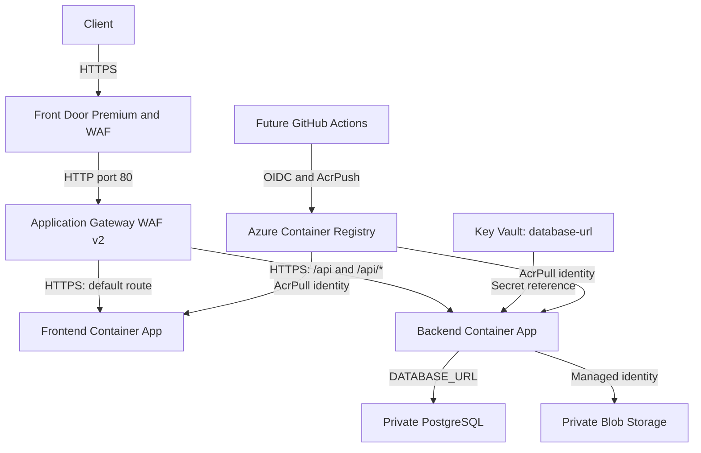

# Repository structure guide

This repository uses Terraform to define an Azure application platform: networking, frontend and backend Container Apps, PostgreSQL, storage, identities, monitoring, and public routing. Application source code, Dockerfiles, and GitHub Actions workflows are not included.

The two main layers are **`environments/prod/`**, which configures and connects the deployment, and **`modules/`**, which contains reusable infrastructure building blocks.

## Folder map

```text
terraform-azure-production/
|-- README.md                         # Overview, design decisions, deployment instructions
|-- .gitignore                        # Excludes state, working files, and some plan files
|-- docs/
|   |-- architecture.md               # Azure resource layout and CI/CD ownership
|   `-- repository-structure.md       # This guide
|-- environments/
|   `-- prod/                         # The only environment currently defined
|       |-- main.tf                   # Comment explaining the file organization
|       |-- versions.tf               # Terraform/provider requirements; no remote backend
|       |-- providers.tf              # Azure provider configuration
|       |-- variables.tf              # Input definitions, defaults, and validation
|       |-- terraform.tfvars          # Values for this deployment
|       |-- terraform.tfvars.example  # Example configuration values
|       |-- locals.tf                 # Shared naming, tags, and database URL
|       |-- data.tf                   # Existing resource group and current Azure identity
|       |-- networking.tf             # VNet, four subnets, and gateway NSG
|       |-- monitoring.tf             # Log Analytics and Application Insights
|       |-- platform.tf               # ACR, storage, and optional Service Bus
|       |-- database.tf               # PostgreSQL and its private DNS zone
|       |-- identities.tf             # Runtime/GitHub identities and role assignments
|       |-- key-vault.tf              # Vault, database secret, and runtime RBAC wait
|       |-- private-endpoints.tf      # Private endpoints and their DNS zones
|       |-- containers.tf             # Internal app environment, DNS, frontend, backend
|       |-- edge.tf                   # Application Gateway and Front Door
|       `-- outputs.tf                # Values exposed after deployment
`-- modules/
    |-- application-gateway/
    |-- application-insights/
    |-- container-app/
    |-- container-app-environment/
    |-- container-registry/
    |-- front-door/
    |-- github-acr-publisher/
    |-- key-vault/
    |-- log-analytics/
    |-- managed-identity/
    |-- network-security-group/
    |-- postgresql/
    |-- private-dns-zone/
    |-- private-endpoint/
    |-- service-bus/
    |-- storage-account/
    |-- subnet/
    `-- virtual-network/
```

## How Terraform uses the layout

Run Terraform from **`environments/prod/`**. The repository root contains documentation and folders, rather than a deployable Terraform root module.

Terraform combines all `.tf` files in that directory into one root module. Filenames organize the code for people; they do not control execution order. The environment's `main.tf` contains only explanatory comments, so start with the files for the services you want to understand.

For example, [networking.tf](../environments/prod/networking.tf) calls a reusable module:

```hcl
module "vnet" {
  source = "../../modules/virtual-network"

  name                = "${local.prefix}-vnet"
  location            = var.location
  resource_group_name = data.azurerm_resource_group.this.name
  address_space       = var.vnet_address_space
  tags                = local.tags
}
```

| Expression | Meaning |
| --- | --- |
| `var.location` | An environment input declared in `variables.tf`. |
| `local.prefix` | A calculated value from `locals.tf`, combining project and environment names. |
| `data.azurerm_resource_group.this.name` | The name of an existing resource group looked up by Terraform. |
| `module.vnet.id` | An output returned by the VNet module, available to other resources. |
| `source = "../../modules/virtual-network"` | The relative path to the module implementation. |

Inputs are passed explicitly to child modules. A child module does not automatically inherit the environment's variables or `terraform.tfvars` values.

## Production files, explained

| File | Responsibility |
| --- | --- |
| [main.tf](../environments/prod/main.tf) | Explains the split across files. Contains no resources. |
| [versions.tf](../environments/prod/versions.tf) | Requires Terraform `>= 1.8.0`, AzureRM `~> 4.0`, Random `~> 3.6`, and Time `~> 0.13`. No remote backend is configured. |
| [providers.tf](../environments/prod/providers.tf) | Configures AzureRM with the subscription input, disables automatic resource-provider registration, and sets Key Vault recovery/purge behavior. |
| [variables.tf](../environments/prod/variables.tf) | Defines subscription, resource names, network ranges, OIDC subjects, app sizing, database settings, and optional Service Bus inputs. |
| [terraform.tfvars](../environments/prod/terraform.tfvars) | Supplies deployment-specific values. Terraform automatically loads it when run in this directory. |
| [terraform.tfvars.example](../environments/prod/terraform.tfvars.example) | A template with placeholder subscription/resource names. Terraform does not automatically load this example file. |
| [locals.tf](../environments/prod/locals.tf) | Builds the project/environment naming prefix, merges tags, and constructs the PostgreSQL connection URL. |
| [data.tf](../environments/prod/data.tf) | Looks up the existing resource group and authenticated Azure client's tenant/object IDs. No resource group is created. |
| [networking.tf](../environments/prod/networking.tf) | Creates a VNet, Application Gateway subnet, delegated Container Apps subnet, delegated PostgreSQL subnet, private endpoint subnet, and gateway NSG. |
| [monitoring.tf](../environments/prod/monitoring.tf) | Creates Log Analytics with 30-day retention and workspace-based Application Insights. |
| [platform.tf](../environments/prod/platform.tf) | Creates Premium ACR, an LRS Storage Account, and optionally a Premium Service Bus namespace and queue. |
| [database.tf](../environments/prod/database.tf) | Creates PostgreSQL Flexible Server and a database with a delegated subnet and private DNS. The production module call disables high availability. |
| [identities.tf](../environments/prod/identities.tf) | Creates separate frontend/backend identities and the GitHub OIDC publisher; assigns ACR, storage, and optional Service Bus roles. |
| [key-vault.tf](../environments/prod/key-vault.tf) | Creates Key Vault and the `database-url` secret, grants backend secret-read access, and adds a 30-second runtime RBAC propagation wait before app creation. |
| [private-endpoints.tf](../environments/prod/private-endpoints.tf) | Creates private endpoints and VNet-linked DNS zones for ACR, Key Vault, and Blob Storage; adds Service Bus equivalents when enabled. |
| [containers.tf](../environments/prod/containers.tf) | Creates an internal Container Apps environment, wildcard private DNS, both apps, registry authentication, environment variables, and the backend's Key Vault secret reference. |
| [edge.tf](../environments/prod/edge.tf) | Connects Application Gateway to the apps and Front Door to the gateway's public FQDN. |
| [outputs.tf](../environments/prod/outputs.tf) | Exposes app names/FQDNs, ACR details, GitHub publisher client ID, tenant/subscription IDs, edge hostnames, and service connection metadata. |

## Reusable modules

Each of the 18 module directories contains:

```text
modules/<module-name>/
|-- main.tf        # Resource implementation
|-- variables.tf   # Inputs accepted by the module
`-- outputs.tf     # Values returned to the environment
```

Read `variables.tf` for the interface, `main.tf` for behavior, and `outputs.tf` for values that other resources can use.

| Module | What it creates |
| --- | --- |
| `virtual-network` | An Azure VNet. |
| `subnet` | A subnet with optional delegation and service endpoints. Called four times by production. |
| `network-security-group` | An NSG, rules, and subnet association. |
| `private-dns-zone` | A private DNS zone, VNet link, and optional A records. Reused for services and the Container Apps domain. |
| `private-endpoint` | A private endpoint with a private DNS zone group. |
| `log-analytics` | A logging workspace. |
| `application-insights` | Application Insights linked to a workspace. |
| `container-registry` | ACR with admin credentials disabled. |
| `storage-account` | StorageV2 with Blob versioning/retention, shared-key access disabled, and OAuth preferred. Does not create Blob containers. |
| `service-bus` | A Premium namespace and queue, with local authentication and public access disabled. |
| `postgresql` | A generated administrator password, private PostgreSQL server, and database. Returns the password as a sensitive output. |
| `managed-identity` | One user-assigned identity; called separately for frontend and backend. |
| `github-acr-publisher` | A dedicated identity, GitHub federated OIDC credentials, and an `AcrPush` role assignment. |
| `key-vault` | An RBAC-enabled vault, optional bootstrap Secrets Officer assignment/wait, and supplied secrets. |
| `container-app-environment` | A Container Apps environment with subnet integration and Log Analytics logging. |
| `container-app` | One app with identity, ingress, registry authentication, environment variables, and optional Key Vault-backed secrets. Used for both apps. |
| `application-gateway` | A static public IP, WAF policy, WAF v2 gateway, probes, and path-based routing. |
| `front-door` | A Premium profile, endpoint, origin group/origin, route, WAF policy, and security-policy association. |

## How the pieces connect

This diagram describes the configured request path, rather than confirming a live deployment.



Both apps run in the same internal environment. Its wildcard private DNS record points to the environment's internal IP so Application Gateway can reach the apps.

Terraform derives creation order from references and explicit `depends_on` declarations:

1. The existing resource group and current Azure identity provide deployment context.
2. Networking supplies subnets; monitoring supplies the logging workspace.
3. Platform services, PostgreSQL, and identities supply service IDs, credentials, and permissions.
4. PostgreSQL outputs feed `local.database_url`, which becomes the Key Vault secret.
5. The apps wait for relevant private endpoints, DNS, and the runtime RBAC delay.
6. App FQDNs feed Application Gateway; the gateway's public FQDN feeds Front Door.

Independent resources can be created in parallel. This is a dependency explanation, rather than an execution order based on filenames.

## State, configuration, and CI/CD ownership

The repository deliberately uses an existing resource group and **local Terraform state**. After initialization/deployment, generated files normally appear under `environments/prod/`:

| Generated artifact | Purpose |
| --- | --- |
| `.terraform/` | Installed providers, module metadata, and initialization data. |
| `.terraform.lock.hcl` | Selected provider versions and checksums. |
| `terraform.tfstate` | Resource tracking and stored values, including the generated database password and secret values. |
| A saved plan, if requested | Proposed changes to review before applying. |

The existing `.gitignore` excludes state and `.terraform/`. It excludes plan names ending in `.tfplan` or `.plan`; the README's extensionless `tfplan` filename is not covered by those patterns. The lock file is not ignored.

Apps initially use a public placeholder image. In `modules/container-app/main.tf`, `ignore_changes` excludes the container image field from subsequent updates. The intended ownership is:

- **Terraform:** infrastructure, identities, permissions, app sizing, environment variables, and secret references.
- **Future CI/CD:** build images, push to ACR, and update each app's deployed image.

The GitHub publisher identity has `AcrPush` on ACR. Its module does not grant permissions to update Container Apps; configure deployment permissions when implementing the workflow. No workflow is included here.

Service Bus is controlled by `deploy_service_bus`, which defaults to `false`. Enabling it creates the namespace/queue, private endpoint/DNS, and backend role assignment. The current backend configuration does not inject Service Bus connection settings.

For bootstrap networking choices, including public ACR access and Key Vault ACLs, see [README.md](../README.md). For the resource overview, see [architecture.md](architecture.md).

## Where to make common changes

| Desired change | Start here |
| --- | --- |
| Subscription, region, resource names, tags, app CPU/memory/ports/replicas, or PostgreSQL sizing | `environments/prod/terraform.tfvars`; consult `variables.tf` for available inputs. |
| Add a configurable setting | Declare it in environment `variables.tf`, use it in the relevant file, and add child-module inputs if required. |
| Change network ranges | Environment input values; subnet composition/delegations are in `networking.tf`. |
| Add app environment variables or secret references | `containers.tf`; create secrets in `key-vault.tf`. |
| Change GitHub repository/branch/environment trust | `github_oidc_subjects` in `terraform.tfvars`. |
| Change runtime permissions | `identities.tf`, or `key-vault.tf` for backend secret-read access. |
| Enable Service Bus | Set `deploy_service_bus = true` and a namespace name in `terraform.tfvars`; inspect `platform.tf`, `private-endpoints.tf`, and `identities.tf`. |
| Change API routing or gateway probes | `modules/application-gateway/main.tf`; environment-supplied probe paths are in `edge.tf`. |
| Change Front Door forwarding, WAF, or routes | `modules/front-door/main.tf`. |
| Expose another deployment value | Add a root output in `environments/prod/outputs.tf`; add a child-module output first if needed. |
| Add another environment | Create a separate directory under `environments/`, reuse `modules/`, and give it separate inputs and state. Only `prod` exists today. |

An environment change affects that deployment. A reusable-module change affects every caller; for example, changing `container-app` can affect both frontend and backend.

## Suggested reading order

1. [README.md](../README.md): project scope and design decisions.
2. [terraform.tfvars.example](../environments/prod/terraform.tfvars.example) and [variables.tf](../environments/prod/variables.tf): deployment inputs.
3. [locals.tf](../environments/prod/locals.tf) and [data.tf](../environments/prod/data.tf): names and Azure context.
4. Networking, platform, database, identity, and Key Vault environment files: service wiring.
5. [containers.tf](../environments/prod/containers.tf) and [edge.tf](../environments/prod/edge.tf): apps and request routing.
6. The relevant `modules/<name>/` folder: implementation details for a service.

For commands and prerequisites, use the [README deployment instructions](../README.md#deploy).

